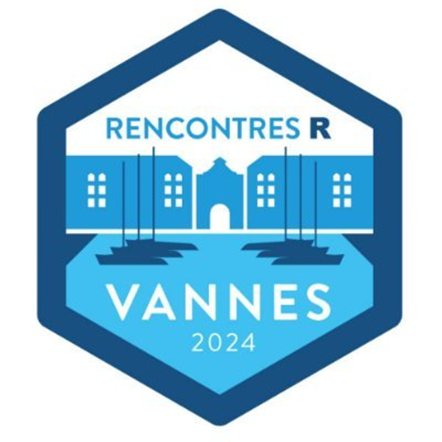

# Rencontres R 2024

## Présentation

Les Rencontres R 2024 se sont tenues du 12 au 14 juin sur le [campus de Tohannic](https://www.univ-ubs.fr/fr/universite-bretagne-sud/infos-pratiques/contact.html) à Vannes, France.

Les Rencontres R, portées par la Société Française de Statistique ([SFdS](https://www.sfds.asso.fr/)), ont pour objectif d'offrir à la communauté francophone un lieu d'échange et de partage d'idées sur l'usage du langage R toutes disciplines confondues.

L'édition 2024 est co-organisée par l'[IRISA](https://www.irisa.fr/), le [LMBA](http://web.univ-ubs.fr/lmba/) et l'[Université Bretagne-Sud](https://www.univ-ubs.fr/fr/index.html). Elle s'adresse aussi bien aux débutants qu'aux utilisateurs confirmés et expérimentés issus de tous les secteurs d'activités.

Plus d'information : https://rr2024.sciencesconf.org  

Twitter : [@rencontres_R](https://twitter.com/rencontres_R)  

Chaine Youtube : [@RencontresR](https://youtube.com/@RencontresR) | [Playlist 2023](https://youtube.com/playlist?list=PLC0_Y4EpEglW-9XRKOzW1QUB2RpBWeHUO)  

Les Rencontres R 2024 c'est :  
-> 150 Participants  
-> 5 Demi-journées  
-> 5 Conférencières et conférenciers invité·e·s
-> 2 Tutoriels  
-> 35 Présentations  
-> 9 Lightning  
-> 9 Posters  

## Programmes

[Retrouvez le programme détaillé sur le site de la conférence](https://rr2024.sciencesconf.org/program).

### [Conférencières et conférenciers invité·e·s](https://rr2024.sciencesconf.org/resource/page/id/21)

* [Apprendre R et les statistiques... grâce à R](https://github.com/BioDataScience-Course/sdd_presentations/blob/master/2024_rencontresr_vannes/presentation/RRvannes2025_grosjean_presentation.pdf)  - Philippe Grosjean, Service d’Écologie numérique, Instituts Infortech et Complexys, Université de Mons, Belgique  - *Modératrice : Chloé Friguet*
* [Comment tirer parti des technologies cloud sans se faire enfermer ? Projet Onyxia](https://rlesur.github.io/rr2024/#/title-slide)  - Romain Lesur, INSEE - *Modérateur : David Gohel*
* [SK8 : Pour des applications shiny qui se déploient comment sur des roulettes](https://hal.inrae.fr/hal-04611375v1)  - Elise Maigné, MIAT, INRAE, Toulouse  - *Modérateur : Paul Bastide*
* [Modélisation conjointe de données longitudinales et de temps d'événements sous R](https://hal.science/hal-04617186)  - Cécile Proust Lima, Inserm, Univ. Bordeaux  - *Modératrice : Solène Desmée*
* [R pour l'océano-météo et l'ingénierie marine](https://github.com/Resourcecode-project/r-resourcecode)  - Raillard Nicolas, Laboratoire Hydrodynamique Marine, Ifremer, Brest  - *Modératrice : Audrey Poterie*

### [Tutoriels](https://rr2024.sciencesconf.org/resource/page/id/20)

* [Dérivation automatique et optimisation avec la libraire torch](https://rr2024.sciencesconf.org/resource/page/id/20) - Tristan Mary-Huard, Université Paris-Saclay, INRAE, CNRS, AgroParisTech, UMR GQE-Le Moulon, 91190 Gif-sur-Yvette, France & Université Paris-Saclay, AgroParisTech, INRAE, UMR MIA-Paris, 91120 Palaiseau, France 
* [Créez des environements reproductibles avec rix](https://is.gd/nix_rr_2024) - Bruno Rodrigues, Ministère de la Recherche et de l’Enseignement supérieur au Luxembourg 

### Posters

* hubeau: un package pour interroger les APIs du Système d'Information sur l'eau en France - Pascal Irz, Direction régionale Bretagne 
* [SK8 : Un service institutionnel de gestion et d'hébergement d'applications Shiny](https://hal.inrae.fr/hal-04141247) - jean-françois rey, Biostatistique et Processus Spatiaux - Élise Maigné, Unité de Mathématiques et Informatique Appliquées de Toulouse 
* [Créer un site pour partager sa recherche avec R, blogdown et Hugo](https://hal.science/hal-04618386) - Fanny Ollivier, Laboratoire de Psychologie des Pays de la Loire 
* Les packages autour de JDemetra+ (rjd3) : une boîte à outils complète pour l'analyse des séries temporelles - Tanguy Barthelemy, INSEE 
* [Poster autour du package {datamods}](Posters/05_Goumri_Samra_Poster autour du package {datamods}.pdf) - Samra Goumri, dreamRs - Victor Perrier, dreamRs 
* [Distance/Divergence entre distributions t multivariées](Posters/06_Santagostini_Bouhlel_mstudentd_DistanceDivergence entre distributions t multivariées.pdf) - Pierre Santagostini, IRHS - Équipe ImHorPhen (Imagerie pour l'Horticulture et le Phénotypage) 
* A survey translation tool to easily migrate from Qualtrics to LimeSurvey - Camille Straboni, Département d'Etudes Cognitives - ENS Paris 
* RecForest : Forêts aléatoires de survie pour l'analyse des événements récurrents en R - Juliette Murris, Health data- and model- driven Knowledge Acquisition 
* [Des tableaux et des graphiques prêts à publication avec les packages R {tabularise} et {chart} de la suite SciViews](https://orbi.umons.ac.be/handle/20.500.12907/49210) - Guyliann Engels, Service d'écologie numérique, Institut Complexys & Infortech, Université de Mons, Cellule de Pédagogie Facultaire des Sciences, Université de Mons 

### Lightning

#### Courte 1 - *Vincent Brault*

* Une enquête auprès des métiers de la « data » : quelle place pour R et ses utilisateurs ? - Antoine Girard, data analyst indépendant 
* [Pour un namespace tout en souplesse](Présentations/01_Mercredi/04_Courte 1/02_Floc'hlay_Swann_Pour un namespace tout en souplesse.html) - Swann Floc'hlay, ThinkR 
* [Cadre R chez IMPACT Initiatives](https://yannsay-impact.github.io/RR2024_presentation_cadreRchezIMPACT/#/title-slide) - Yann Say, IMPACT Initiatives 
* [Comment les communautés autour de R peuvent changer vos pRojets](Présentations/01_Mercredi/04_Courte 1/05_Vaugoyeau_Marie_Comment les communautés autour de R peuvent changer vos pRojets.pdf) - Marie Vaugoyeau, MStats 

#### Courte 2 - *François Husson*

* [Explorer et comparer des cartes de zones climatiques locales avec le paquet lczexplore](https://hal.science/hal-04613802v1) - Matthieu Gousseff, Equipe DECIDE 
* Des applications Shiny qui facilitent la vie - Terence Dechaux, Institut de l'élevage 
* Application Shiny XPBlocs - Création de blocs en expérimentation - Maxime Legris, Institut de l'Elevage 
* Utilisation du package {flexdashboard} pour le contrôle des données de biologie dans un entrepôt de données de santé - Morgane Pierre-Jean, Univ Rennes, CHU Rennes, INSERM, LTSI-UM R 1099 
* [easy16S : une application Shiny pour explorer ses données métagénomiques](https://hal.inrae.fr/hal-04611225) - Cédric Midoux, Université Paris-Saclay, INRAE, PROSE, 92160, Antony, France, Université Paris-Saclay, INRAE, MaIAGE, 78350, Jouy-en-Josas, France, Université Paris-Saclay, INRAE, BioinfOmics, MIGALE bioinformatics facility, 78350, Jouy-en-Josas, France 

### Infrastructure

* [Comment bien rater votre forge logicielle R ?](https://connect.thinkr.fr/rr2023/)  - Vincent Guyader, ThinkR  
* [RKeOps v2: Kernel operations with Symbolic Tensors on the GPU in R](Presentations/1_Mercredi/4a_Infra_I/2_pres_amelie/beamer_rkeops.pdf)  - Amélie Vernay, Institut Montpelliérain Alexander Grothendieck
* [MongoDB](Presentations/1_Mercredi/4a_Infra_I/3_pres_colin/colinfay.pdf) - J'suis pas venu ici pour souffrir, ok ?  - Colin FAY, ThinkR
* [7 Méthodes secrètes des informaticiens pour mieux programmer](Presentations/2_Jeudi/3a_Infra_II/1_LEROY_7_methodes_secretes_pour_mieux_programmer_makina-corpus_regilero.pdf)  - Régis Leroy, Makina Corpus
* [R sur OpenBSD](Presentations/2_Jeudi/3a_Infra_II/2_BUSKVEKSTER_r-sur-openbsd.pdf)  - Andre Buskvekster aka Thomas Levine, Omega Verksted
* [meRoo : Un écosystème logiciel pour l'apprentissage des sciences des données installé sur un cluster de Raspberry Pi](https://regnault.pages.math.cnrs.fr/meroo_pres_rr/20230622_meroo_pres_RR.html#/title-slide)  - Philippe REGNAULT, Laboratoire de Mathématiques de Reims

### Shiny/Plumber

* [Comment Shiny aide Enedis à contribuer à la transition énergétique pour les collectivités territoriales](Presentations/1_Mercredi/4b_Shiny_Plumber_I/rencontres_r_2023_capten_github)  - Gabrielle Devaux, Lincoln, Enedis
* [glitter makes SPARQL: glitter, un package R pour explorer et collecter des données du web sémantique](Presentations/1_Mercredi/4b_Shiny_Plumber_I/2_vaudor_RR_2023/vaudor_preslongue_glitter_RR2023.html)  - Lise Vaudor, Environnement Ville Société
* [Vigie-Analyse, des applications shiny pour les scol'R](Presentations/1_Mercredi/4b_Shiny_Plumber_I/3_benateau_shiny_scolaire.pdf)  - Simon Benateau, CESCO
* [Et si {shiny} n'existait pas. . . ?](Presentations/2_Jeudi/7a_Shiny_Plumber_II/1_si_shiny.html)  - Cervan Girard, ThinkR
* [Construiriez-vous votre cuisine sans en avoir fait des plans ?](https://arthurdata.github.io/rencontresR2023/#/title-slide)  - Arthur Bréant, ThinkR
* [{mariobox}: des APIs {plumber} à toute épreuve](Presentations/2_Jeudi/7a_Shiny_Plumber_II/mariobox-rr23.pdf)  - Antoine Languillaume, ThinkR

### Eduction/Enseignement

* [Initier 2400 personnes à R par enchantement : une histoire de licornes, potion et génie...logiciel](Presentations/1_Mercredi/6a_Education_Enseignement_I/1_murielledelmotte_RR2023.html)  - Murielle Delmotte, ThinkR	
* [Diffuser la culture de la reproductibilité par une formation aux bonnes pratiques: de la qualité d'un projet aux pipelines de données](https://linogaliana.github.io/prez-rr2023-avignon/#/title-slide)  - Lino Galiana, INSEE	
* [Où trouver de l'aide quand on apprend R ?](Presentations/1_Mercredi/6a_Education_Enseignement_I/presentation_rencontres_r_marie_vaugoyeau.pdf)  - Marie Vaugoyeau, MStats
* [Rzine : pour la diffusion et le partage de ressources sur la pratique de R en SHS](https://rzine.gitpages.huma-num.fr/communications/rr2023/#/title-slide)  - Hugues Pecout, CNRS
* [Application {shiny} de correction de projets individuels utilisant R, RStudio, GitHub](Presentations/2_Jeudi/6b_Education_Enseignement_II/2_RRavignon2023_engels_presentation.pdf)  - Guyliann Engels, Service d'écologie numérique, Institut Complexys & Infortech, Université de Mons
* [fRench : R en français](Presentations/2_Jeudi/6b_Education_Enseignement_II/3_fRench.pdf)  - Philippe Grosjean, Université de Mons - UMONS (BELGIQUE)

### Reporting

* [Se démarquer avec les thèmes HTML Quarto.](https://cderv.github.io/rr-2023-quarto-html-theming/)  - Christophe Dervieux, Posit
* [Computo: An academic journal promoting reproductibility via Quarto and Continuous Integration](Presentations/1_Mercredi/6b_Reporting/2_COMPUTO_Chiquet.htm)  - Julien Chiquet, Mathématiques et Informatique Appliquées
* [Synthèse hebdomadaire de la consommation d'électricité française](Presentations/1_Mercredi/6b_Reporting/3_CADORET_3_RTE_SyntheseHebdo_RR2023.pdf)  - Valentin Cadoret, Réseau de Transport d'Electricité [Paris] - Victor PERRIER, dreamRs

### DataViz

* [ggiraph et shiny](https://www.ardata.fr/ggiraph-rr2023/#/title-slide)  - David Gohel, ArData	
* [Visualisations interactives de données au service de la prise de décision sur les études cliniques de phase précoce en oncologie](Presentations/2_Jeudi/6a_Dataviz/2_Sanofi_Rencontres_R_20230621_Charlotte_CHEININ.pdf)  - Charlotte Cheinin, Sanofi	
* [Utiliser R et Python pour le traitement de données : exploration des avantages de Python en matière de visualisation](Presentations/2_Jeudi/6a_Dataviz/R_et_python_mcarlos.pdf)  - Mickaël Carlos, Makina Corpus

### Stats/ML/IA

* [{tabnet} : Un package de deep-learning pour données tabulaires entièrement intégré à tidymodels](Presentations/2_Jeudi/7b_Stat_ML_IA/1_Tabnet_RR2023_fr_pdf.pdf) - Christophe Regouby, Airbus
* [fdacluster: Clustering for Functional Data](Presentations/2_Jeudi/7b_Stat_ML_IA/2_stamm_rr2023_VF.html)  - Aymeric Stamm, Laboratoire de Mathématiques Jean Leray
* [Manipuler les moyennes mobiles avec R et JDemetra+](Presentations/2_Jeudi/7b_Stat_ML_IA/3_Slides_rr_AQLT_Quartier-la-tente.pdf)  - Alain Quartier-la-Tente, Insee

### Geospatial

* [Qualité de l'air ambiant en Wallonie (Belgique) - Visualisation des mesures de la pollution via une app' R-Shiny {golem} dans un environnement ShinyProxy](Presentations/2_Jeudi/3b_Geospatial_I/1_rr2023_20230622_SPANU_ISSEP.pdf)  - Laurent SPANU, Institut Scientifique de Service Public	
* [Suivi de la réponse des agroécosystèmes au changement climatique. Visualisation sur une application R-Shiny](Presentations/2_Jeudi/3b_Geospatial_I/2_Visualisation_de_la_reponse_des_agrosystemes_aux_changements_climatique-Alexis_Fribault.pdf)  - Alexis Fribault, Laboratoire d'étude des Interactions Sol - Agrosystème - Hydrosystème	
* [phacochr: un géocodeur pour les géocoder tous - Package R pour réaliser le géocodage d'adresses en Belgique](Presentations/2_Jeudi/3b_Geospatial_I/3_Presentation_PhacochR_Avignon_vcourte.pdf)  - Joël Girès, Observatoire de la Santé et du Social de Bruxelles-Capitale - Hugo Périlleux, Université Libre de Bruxelles - Institut de Gestion de l'Environnement et d'Aménagement du Territoire
* [Lissage spatial avec le package btb](Presentations/3_Vendredi/3a_Geospatial_II/1_Beyond_The_Border.pdf)  - Kim Antunez, Insee - Julien Pramil, Insee
* [Quelle géostatistique pour des DPE à la localisation incertaine ?](Presentations/3_Vendredi/3a_Geospatial_II/2_rencontresR2023_Marc_Grossouvre_DPE.pdf)  - Marc Grossouvre, Institut Henri Fayol, Département GMI, Espace Fauriel, 29 rue Ponchardier, 42023 Saint-Etienne, U.R.B.S. SAS, Laboratoire d'Informatique, de Modélisation et d'Optimisation des Systèmes
* [Modèle hiérarchique de processus gaussien des plus proches voisins non stationnaire, multivarié, et non séparable, pour la modélisation des polluants atmosphériques](Presentations/3_Vendredi/3a_Geospatial_II/3_sebastien_coube.pdf)  - Sébastien Coube, Université de Pau et des Pays de lÁdour

### Workflow

* [La reproductibilité avec R, ou pourquoi celle-ci est située sur un continuum](https://649017259ea33242fbd1a328--courageous-cajeta-2542d9.netlify.app/#/title-slide)  - Bruno André Rodrigues Coelho, Ministère de l'enseignement supérieur et de la recherche	
* [Faire un package R documenté, testé, versionné et intégré en quelques minutes ? Challenge accepted !](Presentations/3_Vendredi/3b_Workflow/2_faire-un-package_rr2023_florence-mounier/2023-06-23_RR2023_slides_florence.html)  - Florence Mounier, ThinkR	
* [{lozen}, le thermomix de vos projets de développement R](https://ymansiaux.github.io/rencontresR2023)  - YOHANN MANSIAUX, ThinkR

## Les comités

### Comité d'organisation

* Jean-François Rey (Président)
* Edith Gabriel (Trèsorière)
* Emily Walker
* Anna Melnykova
* Marine Marjou
* Sylvie Jouslin
* Tania Jimenez
* Claude Bruchou
* Loic Houde
* Amélie Lagalisse

### Comité de programme

*	Diane Beldame (Présidente)
*	Edith Gabriel
*	Maëlle Salmon
*	Stephane Dray
*	Maria Paula Caldas
*	Marion Louveaux
*	Elisabeth Morand
*	Ahmadou Dicko

### Comité de pilotage

* Marie Chavent
* Stéphane Dray
* Rémy Drouilhet
* Robin Genuer
* Francois Husson
* Julie Josse
* Benoit Liquet

## Remerciements

Nous remercions les différents comités et nos [sponsors](https://rr2023.sciencesconf.org/page/partenaires).
