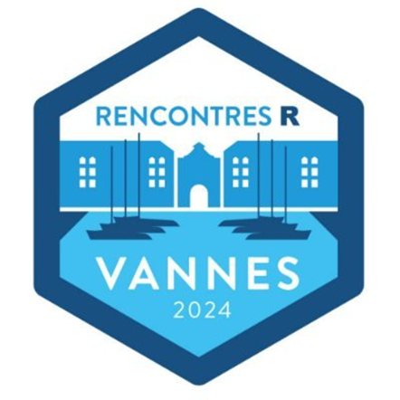
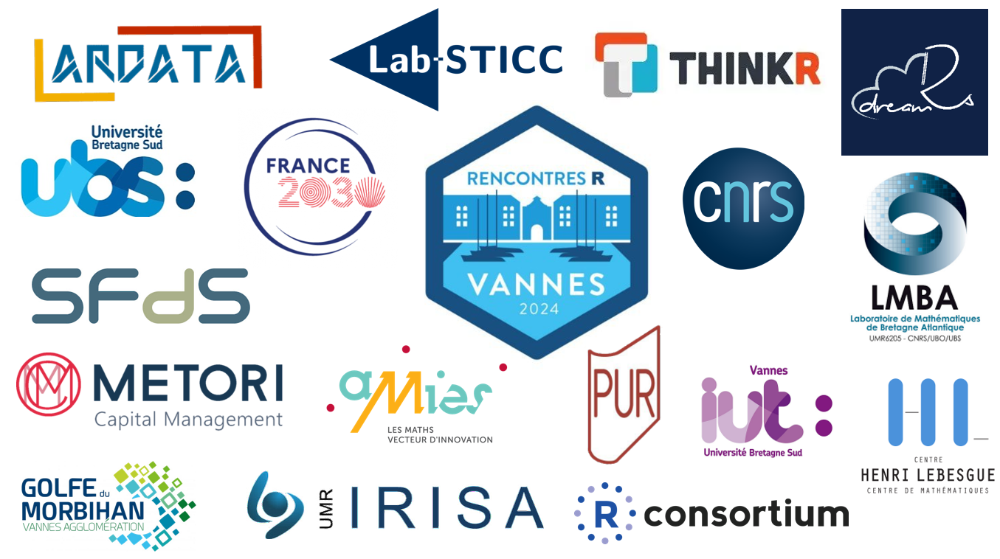

# Rencontres R 2024

## Présentation

Les Rencontres R 2024 se sont tenues du 12 au 14 juin sur le [campus de Tohannic](https://www.univ-ubs.fr/fr/universite-bretagne-sud/infos-pratiques/contact.html) à Vannes, France.

Les Rencontres R, portées par la Société Française de Statistique ([SFdS](https://www.sfds.asso.fr/)), ont pour objectif d'offrir à la communauté francophone un lieu d'échange et de partage d'idées sur l'usage du langage R toutes disciplines confondues.

L'édition 2024 est co-organisée par l'[IRISA](https://www.irisa.fr/), le [LMBA](http://web.univ-ubs.fr/lmba/) et l'[Université Bretagne-Sud](https://www.univ-ubs.fr/fr/index.html). Elle s'adresse aussi bien aux débutants qu'aux utilisateurs confirmés et expérimentés issus de tous les secteurs d'activités.

Plus d'information : https://rr2024.sciencesconf.org  

Twitter : [@rencontres_R](https://twitter.com/rencontres_R) 

LinkedIn : [Rencontres R 🇫🇷](https://www.linkedin.com/groups/14126026/)

Chaine Youtube : [@RencontresR](https://youtube.com/@RencontresR) | [Playlist 2024](https://youtube.com/playlist?list=PLC0_Y4EpEglUSFrCslWRUsHuHoSXn-qbV&si=8jOnXtgjcV5FHD5u)  

Les Rencontres R 2024 c'est :  
-> 152 Participantes et participants  
-> 5 Demi-journées  
-> 5 Conférencières et conférenciers invité·e·s  
-> 2 Tutoriels  
-> 23 Présentations longues  
-> 9 Lightning  
-> 9 Posters dont 3 primés lors de ces rencontres

## Acte des conférences

[Les actes de la conférence des Recontres R 2024 sont disponsibles](Acte_Rencontres_R_2024.pdf)

## Programmes

[Retrouvez le programme détaillé sur le site de la conférence](https://rr2024.sciencesconf.org/program).

### [Conférencières et conférenciers invité·e·s](https://rr2024.sciencesconf.org/resource/page/id/21)

* [Apprendre R et les statistiques... grâce à R](https://github.com/BioDataScience-Course/sdd_presentations/blob/master/2024_rencontresr_vannes/presentation/RRvannes2025_grosjean_presentation.pdf)  - Philippe Grosjean, Service d’Écologie numérique, Instituts Infortech et Complexys, Université de Mons, Belgique  - *Modératrice : Chloé Friguet*
* [Comment tirer parti des technologies cloud sans se faire enfermer ? Projet Onyxia](https://rlesur.github.io/rr2024/#/title-slide)  - Romain Lesur, INSEE - *Modérateur : David Gohel*
* [SK8 : Pour des applications shiny qui se déploient comment sur des roulettes](https://hal.inrae.fr/hal-04611375v1)  - Élise Maigné, MIAT, INRAE, Toulouse  - *Modérateur : Paul Bastide*
* [Modélisation conjointe de données longitudinales et de temps d'événements sous R](https://hal.science/hal-04617186)  - Cécile Proust Lima, Inserm, Univ. Bordeaux  - *Modératrice : Solène Desmée*
* [R pour l'océano-météo et l'ingénierie marine](Présentations/02_Jeudi/01_Nicolas Raillard/Raillard_Nicolas_R pour l'océano-météo et l'ingénierie marine.pdf)  - Raillard Nicolas, Laboratoire Hydrodynamique Marine, Ifremer, Brest  - *Modératrice : Audrey Poterie*

### [Tutoriels](https://rr2024.sciencesconf.org/resource/page/id/20)

* [Dérivation automatique et optimisation avec la libraire torch](https://rr2024.sciencesconf.org/resource/page/id/20) - Tristan Mary-Huard, Université Paris-Saclay, INRAE, CNRS, AgroParisTech, UMR GQE-Le Moulon, 91190 Gif-sur-Yvette, France & Université Paris-Saclay, AgroParisTech, INRAE, UMR MIA-Paris, 91120 Palaiseau, France 
* [Créez des environements reproductibles avec rix](https://is.gd/nix_rr_2024) - Bruno Rodrigues, Ministère de la Recherche et de l’Enseignement supérieur au Luxembourg 

### Posters

* [hubeau: un package pour interroger les APIs du Système d'Information sur l'eau en France](Posters/01_Irz_Pascal_hubeau un package pour interroger les APIs du Système d'Information sur l'eau en France.pdf) - Pascal Irz, Direction régionale Bretagne 
* [SK8 : Un service institutionnel de gestion et d'hébergement d'applications Shiny](https://hal.inrae.fr/hal-04141247) - Jean-François rey, Biostatistique et Processus Spatiaux - Élise Maigné, Unité de Mathématiques et Informatique Appliquées de Toulouse 
* [Créer un site pour partager sa recherche avec R, blogdown et Hugo](https://hal.science/hal-04618386) - Fanny Ollivier, Laboratoire de Psychologie des Pays de la Loire 
* [Les packages autour de JDemetra+ (rjd3) : une boîte à outils complète pour l'analyse des séries temporelles](https://raw.githubusercontent.com/TanguyBarthelemy/rr2024/main/figures/poster.png) - Tanguy Barthelemy, INSEE 
* [Poster autour du package {datamods}](Posters/05_Goumri_Samra_Poster autour du package {datamods}.pdf) - Samra Goumri, dreamRs - Victor Perrier, dreamRs 
* [Distance/Divergence entre distributions t multivariées](Posters/06_Santagostini_Bouhlel_mstudentd_DistanceDivergence entre distributions t multivariées.pdf) - Pierre Santagostini, IRHS - Équipe ImHorPhen (Imagerie pour l'Horticulture et le Phénotypage) 
*  A survey translation tool to easily migrate from Qualtrics to LimeSurvey - Camille Straboni, Département d'Etudes Cognitives - ENS Paris 
*  [RecForest : Forêts aléatoires de survie pour l'analyse des événements récurrents en R](Posters/08_Murris_Juliette_RecForest  Forêts aléatoires de survie pour l'analyse des événements récurrents en R.pdf) - Juliette Murris, Health data- and model- driven Knowledge Acquisition 
*  [Des tableaux et des graphiques prêts à publication avec les packages R {tabularise} et {chart} de la suite SciViews](https://orbi.umons.ac.be/handle/20.500.12907/49210) - Guyliann Engels, Service d'écologie numérique, Institut Complexys & Infortech, Université de Mons, Cellule de Pédagogie Facultaire des Sciences, Université de Mons 

 : Prix du jury

### Lightning

#### Courte 1 - *Vincent Brault*

* [Une enquête auprès des métiers de la « data » : quelle place pour R et ses utilisateurs ?](Présentations/01_Mercredi/04_Courte 1/01_Girard_Antoine_Une enquête auprès des métiers de la « data »  quelle place pour R et ses utilisateurs.pdf) - Antoine Girard, data analyst indépendant 
* [Pour un namespace tout en souplesse](Présentations/01_Mercredi/04_Courte 1/02_Floc'hlay_Swann_Pour un namespace tout en souplesse.html) - Swann Floc'hlay, ThinkR 
* [Cadre R chez IMPACT Initiatives](https://yannsay-impact.github.io/RR2024_presentation_cadreRchezIMPACT/#/title-slide) - Yann Say, IMPACT Initiatives 
* [Comment les communautés autour de R peuvent changer vos pRojets](Présentations/01_Mercredi/04_Courte 1/05_Vaugoyeau_Marie_Comment les communautés autour de R peuvent changer vos pRojets.pdf) - Marie Vaugoyeau, MStats 

#### Courte 2 - *François Husson*

* [Explorer et comparer des cartes de zones climatiques locales avec le paquet lczexplore](https://hal.science/hal-04613802v1) - Matthieu Gousseff, Equipe DECIDE 
* [Des applications Shiny qui facilitent la vie](Présentations/02_Jeudi/05_Courte 2/02_Dechaux_Terence_Des applications Shiny qui facilitent la vie.pdf) - Terence Dechaux, Institut de l'élevage 
* Application Shiny XPBlocs - Création de blocs en expérimentation - Maxime Legris, Institut de l'Elevage 
* Utilisation du package {flexdashboard} pour le contrôle des données de biologie dans un entrepôt de données de santé - Morgane Pierre-Jean, Univ Rennes, CHU Rennes, INSERM, LTSI-UM R 1099 
* [easy16S : une application Shiny pour explorer ses données métagénomiques](https://hal.inrae.fr/hal-04611225) - Cédric Midoux, Université Paris-Saclay, INRAE, PROSE, 92160, Antony, France, Université Paris-Saclay, INRAE, MaIAGE, 78350, Jouy-en-Josas, France, Université Paris-Saclay, INRAE, BioinfOmics, MIGALE bioinformatics facility, 78350, Jouy-en-Josas, France 

### Présentations longues

#### Aide à la vie de tous les jours et à l'enseignement - *Audrey Lavenu*

* Un petit coup de polish - Nettoyage de fichiers Excel avec R - Thomas Vroylandt, Kantiles 
* [{saperlipopette}, un paquet R pour progresser en Git en toute sérénité](Présentations/02_Jeudi/07_A101_Enseignement/02_Salmon_maelle_saperlipopette, un paquet R pour progresser en Git en toute sérénité.pdf) - Maëlle SALMON, rOpenSci, cynkra 
* [Génération aléatoire d'exercices de biostatistiques pour Moodle via le package SARP.Moodle de R](https://hal.science/hal-04616646) - Emmanuel Curis, UR 7537 BioSTM, Faculté de pharmacie de Paris, Service d'Hématologie Biologique [CHU Lariboisière] 

#### Biostatistique - *Julie Aubert*

* [Extending code from the saemix package to fit parametric joint models in R](Présentations/01_Mercredi/02_Biostatistique/01_Comets_Emmanuelle_Extending code from the saemix package to fit parametric joint models in R.pdf) - Emmanuelle Comets, Infection, Anti-microbiens, Modélisation, Evolution, Institut de recherche en santé, environnement et travail 
* [Mise en oeuvre de méthodes semi-Bayésiennes de calcul des erreurs standards pour les données éparses dans le package saemix](https://hal.science/hal-04617156) - Mélanie Guhl, Université Paris Cité, INSERM, IAME, UMR 1137 
* [BeQut, un package R pour l'estimation bayésienne de modèles de régression quantile à effets mixtes via JAGS](Présentations/01_Mercredi/02_Biostatistique/003_Barbieri_Antoine_BeQut, un package R pour l'estimation bayésienne de modèles de régression quantile à effets mixtes via JAGS.pdf) - Antoine Barbieri, Univ. Bordeaux, Inserm BPH U1219, F-33000, Bordeaux 

#### Dataviz - *Julie Lenoir*

* [telraamStats : visualisation des mobilités pour la recherche et les citoyen·ne·s](Présentations/02_Jeudi/02_Dataviz/01_Guichard-Sustowski_Ketsia_telraamStats  visualisation des mobilités pour la recherche et les citoyen·ne·s.pdf) - Ketsia Guichard-Sustowski, Institut de Recherche Mathématique de Rennes, Centre de recherche en économie et management 
* [Collecter et cartographier les données du bilan carbone d'un congrès](https://husson.github.io/img/presRR24.html#/title-slide) - Chloé Friguet, Université Bretagne Sud / IRISA et François Husson, Laboratoire de Mathématiques Appliquées - Agrocampus Rennes 

#### Gestion de projet R, bonnes pratiques - *Pierre Gloaguen*

* [Sécurisation des analyses statistiques avec R : retour d'expérience](Présentations/02_Jeudi/07_A250_Gestion de projet/01_Philibert_Aurore_Dugas_Julien_Sécurisation des analyses statistiques avec R  retour d'expérience.pdf) - Aurore Philibert, Pôle Biostatistique - Julien Dugas, Pôle Biostatistique 
* [Refactoring : du code qui marche, c'est bien, mais du code maintenable, c'est mieux](Présentations/02_Jeudi/07_A250_Gestion de projet/02_Guyader_Vincent_Refactoring  du code qui marche, c'est bien, mais du code maintenable, c'est mieux.html) - Vincent Guyader, ThinkR 
* Une vie polyamoureuse entre R et Julia - Remy Drouilhet, Laboratoire Jean Kuntzmann 

#### Méthode statistique - *Vincent Brault*

* Estimation de quantiles conditionnels extrêmes : Package Extremefit - Gilles Durrieu, Laboratoire de Mathématiques de Bretagne Atlantique 
* [Clustering sur données incomplètes avec clusterMI](Présentations/02_Jeudi/03_Méthode Statistique/02_Audigier_Vincent_Clustering sur données incomplètes avec clusterMI.pdf) - Vincent Audigier, Conservatoire National des Arts et Métiers [CNAM] : EA4629 
* [Créer son propre package d'extension {recipes}: retour d'expérience de {scimo}](Présentations/02_Jeudi/03_Méthode Statistique/03_Bichat_Antoine_Créer son propre package d'extension recipes retour d'expérience de scimo.pdf) - Antoine Bichat, Les Laboratoires Servier 
* Smooth testing and clustering of copulas - Yves Ismaël Ngounou Bakam, CREST-ENSAI 

#### Reproductibilité - *Aurélie Siberchicot*

* [Garantir des analyses fiables avec les packages R : perspectives de la recherche clinique](Présentations/01_Mercredi/03_Reproductibilité/01_Féat_Yann_Guaranteeing reliable analyses with R packages perspectives from clinical research.pdf) - Yann Féat, mainanalytics GmbH 
* [Créez des environements reproductibles avec rix](https://is.gd/nix_rr_2024) - Bruno André Rodrigues Coelho, Ministère de l'enseignement supérieur et de la recherche

#### Shiny - *Swann Floc'hlay*

* Microstructure Information from Diffusion Imaging - Aymeric Stamm, Department of Mathematics Jean Leray 
* [Esquisse, un outil de visualisation](Présentations/03_Vendredi/02_Shiny/02_Perrier_Victor_Esquisse, un outil de visualisation.pdf) - Victor PERRIER, dreamRs 
* webR, et le futur des apps web avec R - Colin FAY, ThinkR 

#### Statistique pour l'environnement - *Baptiste Alglave*

* Human in the deep: Converting research activities pressures into ecological impact assessment. - Riwan Leroux, Institut Français de Recherche pour l'Exploitation de la Mer 
* [Maturation de codes scientifiques R de traitement de données liées à l'Eau au BRGM (initiative MATUREAU)](Présentations/02_Jeudi/06_A250_Statistique pour l'environnement/02_Laurencelle_Marc_Maturation de codes scientifiques R de traitement de données liées à l'Eau au BRGM - initiative MATUREAU.pdf) - Marc Laurencelle, Bureau de Recherches Géologiques et Minières (BRGM) 
* [Un suivi régionalisé et actualisé des étiages des petits cours d'eau, c'est possible avec R, Hub'Eau et GitHub !](https://hal.science/hal-04613400) - Pascal Irz, Direction régionale Bretagne 

## Les comités

### Comité d'organisation

* Baptiste ALGLAVE IUT SD, Univ. Bretagne-Sud, Lab-sticc, Vannes
* Anne CUZOL, IUT SD, Univ. Bretagne Sud, LMBA, Vannes
* Chloé FRIGUET IUT SD, Univ. Bretagne-Sud, IRISA, Vannes (présidente)
* Pierre GLOAGUEN, UFR SSI, Univ. Bretagne Sud, LMBA, Vannes (trésorier)
* Audrey POTERIE, IUT SD, Univ. Bretagne Sud, LMBA, Vannes
* François SEPTIER, UFR SSI, Univ. Bretagne Sud, LMBA, Vannes

#### Administratifs :

* Pauline GORRE, IE appui à la Recherche/thématique IA, DRUID, Univ. Bretagne Sud, Vannes
* Antoine L'AZOU, gestionnaire, IRISA-CNRS, Rennes
* Aurélie JOUBEL, gestionnaire, LMBA, Univ. Bretagne Sud, Vannes

### Comité de programme

* Paul BASTIDE, IMAG-CNRS, Montpellier
* Vincent BRAULT, IUT SD, Univ Grenoble-Alpes, LJK, Grenoble (président)
* Marie CHION, University of Cambridge, UK
* Solène DESMEE, IUT GB, Univ. Tours, SPHERE-INSERM, Tours
* David GOHEL, Fondateur ARDATA, Paris
* François HUSSON, Institut Agro, IRMAR, Rennes
* Audrey POTERIE, IUT SD, Univ. Bretagne Sud, LMBA, Vannes
* Geneviève ROBIN, LaMME-CNRS Evry et Owkin, Paris

### Comité de pilotage

* Julie AUBERT - AgroParisTech
* Rémy DROUILHET - Université Grenoble Alpes
* Robin GENUER - Université de Bordeaux
* Francois HUSSON - Institut Agro, Rennes
* Julie JOSSE - INRIA, Montpellier
* Aurélie SIBERCHICOT - Université Lyon 1

## Remerciements

Nous remercions les participantes et participants, les intervenantes et intervenants, les différents comités et nos [sponsors](https://rr2024.sciencesconf.org/resource/page/id/5).

### Discours de clôture pour remercier les participantes et les participants

Après avoir [collecté et cartographié les données du congrès](https://husson.github.io/img/presRR24.html#/title-slide), 
[esquissé un outil de visualisation](Présentations/03_Vendredi/02_Shiny/02_Perrier_Victor_Esquisse, un outil de visualisation.pdf) et 
[sécurisé](Présentations/02_Jeudi/07_A250_Gestion de projet/01_Philibert_Aurore_Dugas_Julien_Sécurisation des analyses statistiques avec R  retour d'expérience.pdf) nos 
[analyses statistiques avec R](Présentations/02_Jeudi/07_A250_Gestion de projet/01_Philibert_Aurore_Dugas_Julien_Sécurisation des analyses statistiques avec R  retour d'expérience.pdf), nous pouvons vous faire un 
[retour d'expérience](Présentations/02_Jeudi/07_A250_Gestion de projet/01_Philibert_Aurore_Dugas_Julien_Sécurisation des analyses statistiques avec R  retour d'expérience.pdf). Cette conférence fut comme 
[un site pour partager sa recherche](https://hal.science/hal-04618386), un endroit pour 
[maturer des codes scientifiques de traitement de données liées à l'Eau](Présentations/02_Jeudi/06_A250_Statistique pour l'environnement/02_Laurencelle_Marc_Maturation de codes scientifiques R de traitement de données liées à l'Eau au BRGM - initiative MATUREAU.pdf) ou encore 
[visualiser des mobilités pour la recherche et les citoyen·ne·s](Présentations/02_Jeudi/02_Dataviz/01_Guichard-Sustowski_Ketsia_telraamStats  visualisation des mobilités pour la recherche et les citoyen·ne·s.pdf) 
même si nous avons des 
[données incomplètes](Présentations/02_Jeudi/03_Méthode Statistique/02_Audigier_Vincent_Clustering sur données incomplètes avec clusterMI.pdf). Nous avons vu des 
[applications Shiny qui facilitent la vie](Présentations/02_Jeudi/05_Courte 2/02_Dechaux_Terence_Des applications Shiny qui facilitent la vie.pdf), des applications Shiny élégantes et performantes 
[qui se déploient comme sur des roulettes](https://hal.inrae.fr/hal-04611375v1) et tout 
ceci a eu un [IMPACT](https://yannsay-impact.github.io/RR2024_presentation_cadreRchezIMPACT/#/title-slide) sur nos [Initiatives](https://yannsay-impact.github.io/RR2024_presentation_cadreRchezIMPACT/#/title-slide) afin de 
mieux Comunicate notamment en HTTP. Nous avons [exploré des données métagénomiques](https://hal.inrae.fr/hal-04611225), des 
[modélisation conjointe de données longitudinales et de temps d'événements](https://hal.science/hal-04617186) et bien sûr des 
[modèles de régression quantile à effets mixtes](Présentations/01_Mercredi/02_Biostatistique/003_Barbieri_Antoine_BeQut, un package R pour l'estimation bayésienne de modèles de régression quantile à effets mixtes via JAGS.pdf).  
  
Durant ces trois jours, nous avons fait [des blocs en expérimentation](https://rr2024.sciencesconf.org/543823), des
[retours d'expérience](Présentations/02_Jeudi/03_Méthode Statistique/03_Bichat_Antoine_Créer son propre package d'extension recipes retour d'expérience de scimo.pdf), ce fut parfois dans des [conditions extrêmes](https://rr2024.sciencesconf.org/548415) et nous avons fait 
[des erreurs standards](https://hal.science/hal-04617156) notamment 
[pour les données éparses](https://hal.science/hal-04617156) en touchant le [fond](https://rr2024.sciencesconf.org/547938). Mais [un petit coup de polish](https://rr2024.sciencesconf.org/542773) et 
[saperlipopette](Présentations/02_Jeudi/07_A101_Enseignement/02_Salmon_maelle_saperlipopette, un paquet R pour progresser en Git en toute sérénité.pdf), on a pu 
[progresser en toute sérénité](Présentations/02_Jeudi/07_A101_Enseignement/02_Salmon_maelle_saperlipopette, un paquet R pour progresser en Git en toute sérénité.pdf). Petit à petit 
[les petits cours d'eau](https://hal.science/hal-04613400) ont formé des grandes rivières et au travers [de zones climatiques locales](https://hal.science/hal-04613802v1) a abouti sur une vraie 
[ingénierie marine](Présentations/02_Jeudi/01_Nicolas Raillard/Raillard_Nicolas_R pour l'océano-météo et l'ingénierie marine.pdf).  
  
Nous avons aussi parlé [de biologie et de santé](https://rr2024.sciencesconf.org/539452), en restant
[fiables](Présentations/01_Mercredi/03_Reproductibilité/01_Féat_Yann_Guaranteeing reliable analyses with R packages perspectives from clinical research.pdf) mais sans être trop 
[clinique](Présentations/01_Mercredi/03_Reproductibilité/01_Féat_Yann_Guaranteeing reliable analyses with R packages perspectives from clinical research.pdf) 
[tout en souplesse](Présentations/01_Mercredi/04_Courte 1/02_Floc'hlay_Swann_Pour un namespace tout en souplesse.html) puisque nous avons [créé des environnements reproductibles avec rix](https://is.gd/nix_rr_2024) 
([deux fois](https://is.gd/nix_rr_2024)). Nous avons formé une [communauté autour de R](Présentations/01_Mercredi/04_Courte 1/05_Vaugoyeau_Marie_Comment les communautés autour de R peuvent changer vos pRojets.pdf), des 
[clusters de copules](https://rr2024.sciencesconf.org/543892) voir parfois été dans [une vie polyamoureuse avec Julia](https://rr2024.sciencesconf.org/543985).  
  
Si nous faisions [une enquête auprès des](Présentations/01_Mercredi/04_Courte 1/01_Girard_Antoine_Une enquête auprès des métiers de la « data »  quelle place pour R et ses utilisateurs.pdf) participants autour des 
[posters](Posters/05_Goumri_Samra_Poster autour du package {datamods}.pdf), je suis sûr que beaucoup me diraient, 
[qu’une marche, c'est bien](Présentations/02_Jeudi/07_A250_Gestion de projet/02_Guyader_Vincent_Refactoring  du code qui marche, c'est bien, mais du code maintenable, c'est mieux.html), surtout dans des 
[forêts aléatoires de survie](Posters/08_Murris_Juliette_RecForest  Forêts aléatoires de survie pour l'analyse des événements récurrents en R.pdf) mais 
[apprendre R et les statistiques... grâce à R](https://github.com/BioDataScience-Course/sdd_presentations/blob/master/2024_rencontresr_vannes/presentation/RRvannes2025_grosjean_presentation.pdf) afin d’avoir 
[des tableaux et des graphiques prêts à publication](https://orbi.umons.ac.be/handle/20.500.12907/49210) et de faire une [génération aléatoire d'exercices pour Moodle](https://hal.science/hal-04616646) tout en 
[étendant nos codes](Présentations/01_Mercredi/02_Biostatistique/01_Comets_Emmanuelle_Extending code from the saemix package to fit parametric joint models in R.pdf), c’est mieux.  
  
Il est temps de prendre nos [distances](Posters/06_Santagostini_Bouhlel_mstudentd_DistanceDivergence entre distributions t multivariées.pdf) et de [migrer](https://rr2024.sciencesconf.org/546658) loin de Vannes. Prenez votre 
[SK8](https://hal.inrae.fr/hal-04141247), votre bouteille d[’eau](Posters/01_Irz_Pascal_hubeau un package pour interroger les APIs du Système d'Information sur l'eau en France.pdf) et surtout votre 
[torch](https://rr2024.sciencesconf.org/560087) afin d’éclairer le monde. Nous vous avons donné 
[une boîte à outils complète pour l’analyse afin](https://raw.githubusercontent.com/TanguyBarthelemy/rr2024/main/figures/poster.png) de [diffuser l’image](https://rr2024.sciencesconf.org/544084) que [le futur](https://rr2024.sciencesconf.org/537480) c’est 
[avec R](https://rr2024.sciencesconf.org/537480).

